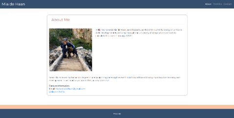

# My Portfolio

This portfolio webpage was created by utilizing the css framework, Bootstrap, to create a responsive design. Included in this page are links in the Navbar to the following HTML pages: About Me, Portfolio, & Contact. "About Me" contains an image and desciption about myself. The portfolio page contains images of where all my future projects will be. And the contact page conatins a form for users (hopefully future employers) to input their contact information. Additionally, the design of the page re-adjusts depending on the screen resolution.

The validation service,W3C Markup Validation Service, was used to double check my HTML files for any errors. 

#Links

[Deployed Application URL](https://miadehaan.github.io/index.html)

[Github Repository](https://github.com/miadehaan/miadehaan.github.io)
