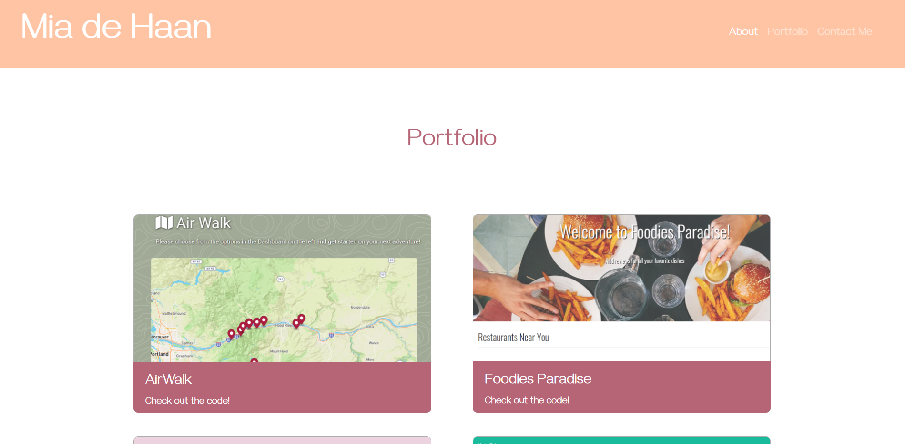
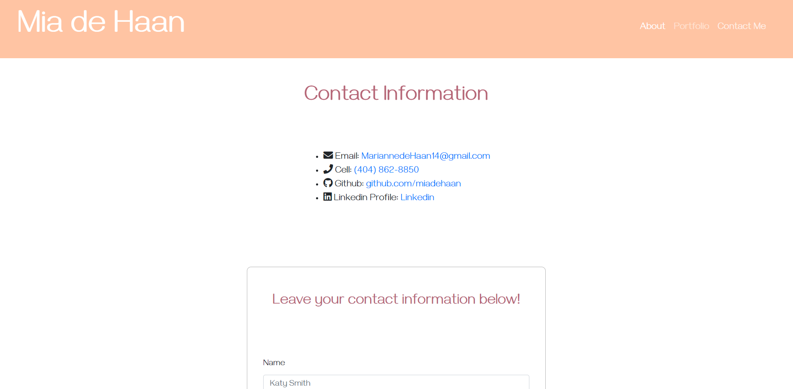

# My Portfolio

## Description 

This portfolio webpage was created by utilizing the css framework, Bootstrap, to create a responsive design. Included in this page are links in the Navbar to the following HTML pages: About Me, Portfolio, & Contact. "About Me" contains images of myself, a desciption, & a downloadable link to my resume. The "Portfolio" page contains images & links to all my projects and their code. And the "Contact" page conatins a form for users (hopefully future employers) to input their contact information. Additionally, the design of the page re-adjusts depending on the screen resolution. The validation service, W3C Markup Validation Service, was used to double check my HTML files for any errors. 

## Table of Contents
- [Description](#Description)
- [Links](#Links)
- [Technologies](#Technologies)
- [Application](#Application)
- [Questions](#Questions)
- [License](#License)

## Links

[Deployed Application URL](https://miadehaan.github.io/index.html)

[Github Repository](https://github.com/miadehaan/miadehaan.github.io)

## Technologies

**Tech/Framework Used/Tech Stack**

- HTML
- CSS
- Bootstrap Framework

## Application

## Questions
If you have any questions, please contact me at the email below. Check out my Github portfolio for more of my projects!

- Github Username: miadehaan
- Github Portfolio: (https://miadehaan.github.io/)
- Github Email: (mariannedehaan14@gmail.com)

## License

[MIT License](LICENSE)

